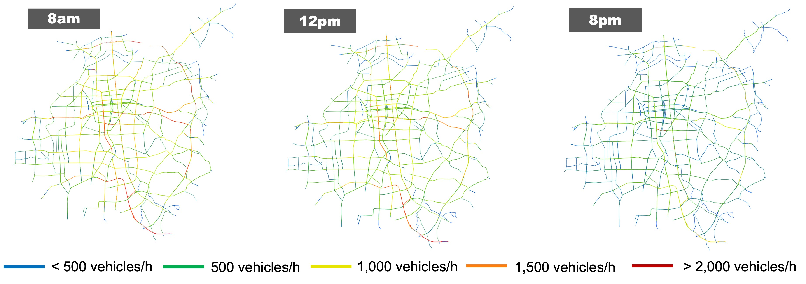

# Nagoya Urban Mobility (NUMo) Scenario

## City-Scale SUMO Traffic Scenario of Nagoya, Japan

NUMo is a road traffic simulation scenario, modeling the realistic vehicle mobility in Nagoya, Japan. The road traffic volume is thoroughly calibrated on 1,618 road segments across the city, while traffic light cycles are also aligned with the historical data. The model can be executed in an open-sourced road traffic simulator SUMO, which can easily be interfaced with various network simulators like OMNeT++ and ns-3. 1.6 million vehicle trips are simulated in a 24-hour period, making it one of the largest SUMO traffic scenarios that are open to the research community.

| Attribute | Value |
| :---: | :---: | 
| Area of interest | 326 sq. km |
| Total edge length | 1,494 km |
| Total lane length | 3,300 km |
| Duration | 24h |
| Number of junctions | 7,833 |
| Number of edges | 11,520 |
| Number of traffic lights | 1,593 |
| Number of departed vehicles | 1,627,151 |
| Number of collisions | 0 |
| Number of teleports | 561 |

## Publication

> Takamasa Higuchi, Lei Zhong, Ryokichi Onishi. "NUMo: Nagoya Urban Mobility Scenario for City-Scale V2X Simulations," in Proceedings of the 2024 IEEE Vehicular Networking Conference (VNC), 2024. 

## Usage

Follow the [SUMO official documentation](https://eclipse.dev/sumo/) to install the SUMO road traffic simulator. 
The NUMo scenario has been generated and validated with the SUMO version 1.19. 

A simulation can be executed with the following command:

`sumo -c nagoya.sumocfg`

If you want to enable the SUMO GUI, use the following command instead:

`sumo-gui -c nagoya.sumocfg`

## Licenses

The SUMO network file `nagoya.net.xml` was originally imported from the OpenStreetMap (https://www.openstreetmap.org/), and is made available under the Open Database License: http://opendatacommons.org/licenses/odbl/1.0/. Any rights in individual contents of the database are licensed under the Database Contents License: http://opendatacommons.org/licenses/dbcl/1.0/.

All other files are licensed under the Creative Commons Attribution 4.0 International License: http://creativecommons.org/licenses/by/4.0/.
